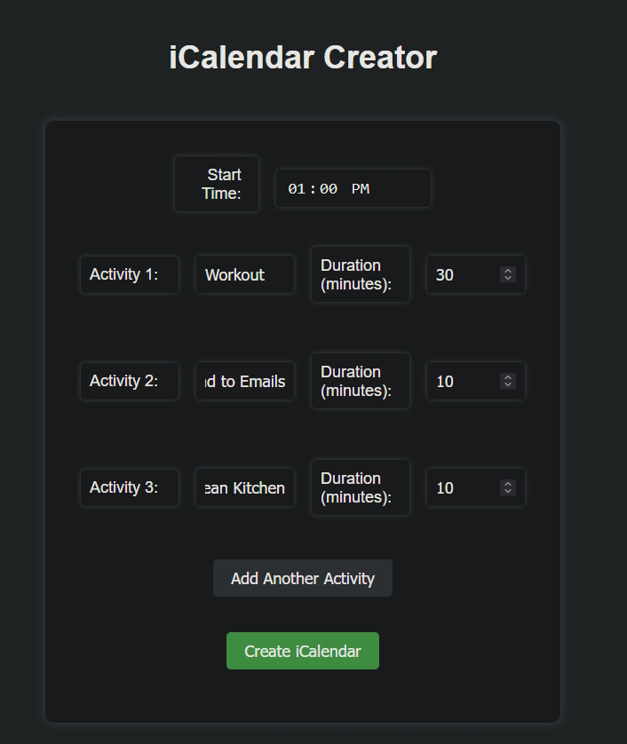
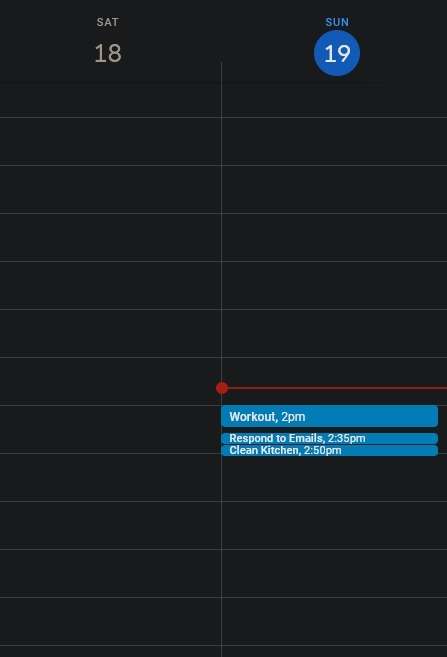

# Superblock-Calendar

A simple project that contains an html file that prompts for a certain number of tasks, task duration, and a start time.
This is used to create what I call a "Superblock" or a period of time where you schedule yourself to do all the tasks that you need to do -- this tool gives you a push to do it within a timeframe.
This html tied with the javascript file creates an ics file that you can add to your calendar so that all of your superblock activity is logged neatly

